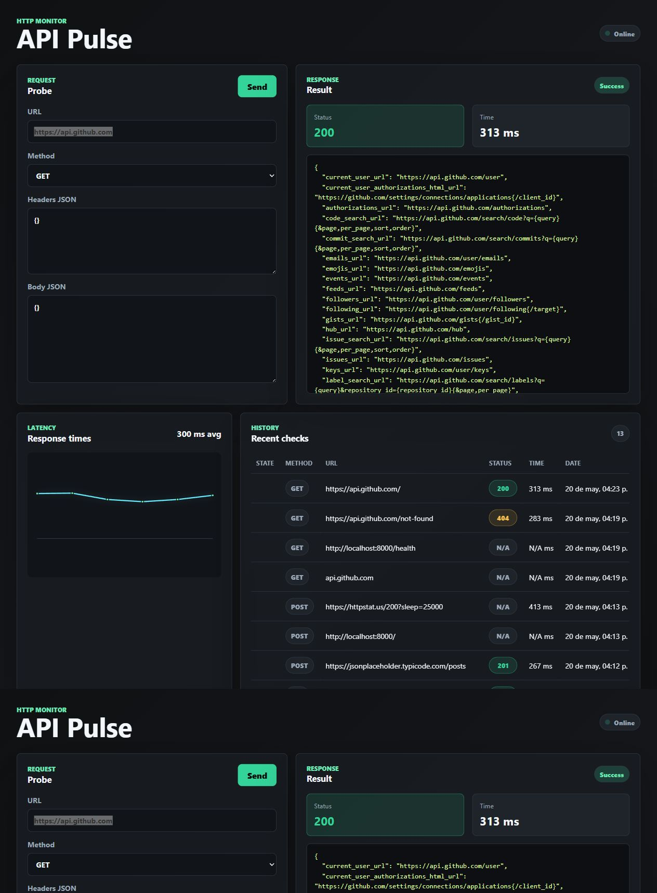

# API Pulse

Aplicación para probar APIs HTTP públicas, medir tiempos de respuesta y consultar un historial persistente. Interfaz oscura en Vue 3, API en FastAPI y almacenamiento en PostgreSQL.

**Objetivo acordado:** terminar un proyecto de portafolio con despliegue público. El MVP está implementado; la publicación y la preparación para exposición pública están pendientes.

## Retomar el proyecto

1. Lee [el estado verificado](docs/ESTADO_ACTUAL.md).
2. Sigue [el plan de cierre](docs/PLAN_DE_CIERRE.md), con tareas y criterios de aceptación.
3. Para continuar con GPT-5.6, usa [el relevo y el prompt de inicio](docs/CONTINUIDAD_GPT_5_6.md).
4. Consulta [el índice de documentación](docs/README.md) y las instrucciones de [AGENTS.md](AGENTS.md).

Corte documental: **15 de septiembre de 2026**, sobre el commit local `7399e86` más cambios de T01/T02/T03 aún sin commit. Esta fecha no certifica despliegue.

## Funciones actuales

- Solicitudes manuales GET, POST, PUT y DELETE con cabeceras y cuerpo JSON.
- Resultado con código HTTP, tiempo y contenido JSON o texto.
- Historial de las últimas 50 comprobaciones en la interfaz.
- Gráfica de las últimas 12 comprobaciones con respuesta y tiempo válido.
- Validación de URL y bloqueo de direcciones locales o privadas.
- Pruebas de backend y flujo de calidad de GitHub Actions.

`success=true` significa que se recibió una respuesta HTTP: también puede acompañar a un 404 o un 500. Consulta el [contrato de la API](docs/API.md). Las solicitudes son manuales; todavía no existe un monitor programado.

## Vista del MVP

Captura histórica existente, de mayo de 2026. La evidencia visual del despliegue final sigue pendiente.

## Inicio local con Docker

Requisitos: Docker Engine activo y Docker Compose. Ejecuta los comandos desde la raíz real del repositorio.

~~~powershell
# Opcional: crear configuración local sin sobrescribir una existente.
if (-not (Test-Path .env)) { Copy-Item .env.example .env }
docker compose up --build -d
docker compose ps
~~~

- Interfaz: http://localhost:5173
- API: http://localhost:8000
- Contrato interactivo de FastAPI: http://localhost:8000/docs
- Salud del proceso: http://localhost:8000/health

Si el puerto 5173 está ocupado:

~~~powershell
$env:FRONTEND_PORT = "5174"
$env:FRONTEND_ORIGIN = "http://localhost:5174"
docker compose up --build -d
~~~

Configuración completa, puertos y comandos de calidad: [desarrollo y validación](docs/DESARROLLO_Y_VALIDACION.md). Este Compose utiliza Vite en modo desarrollo y no es una configuración final de producción.

## Estructura

~~~text
AGENTS.md                  Instrucciones para trabajar con el repositorio
backend/app/               API, persistencia y cliente HTTP saliente
backend/tests/             Pruebas de backend
frontend/src/              Interfaz Vue y servicio de acceso a la API
.github/workflows/         Verificaciones automatizadas
docker-compose.yml         Entorno local
compose.integration.yml    Stack aislado de validación con destino controlado
tests/integration/         Servidor HTTP exclusivo de las pruebas integradas
docs/                      Requisitos, decisiones, arquitectura y continuidad
~~~

## Estado de calidad

Verificado localmente en T01/T02/T03: 40 casos de pytest, 4 pruebas frontend, Ruff, compilación Python, configuración de Compose, instalación reproducible, build, lint y auditoría con cero vulnerabilidades conocidas. El flujo completo se comprobó con PostgreSQL 16 real y un destino HTTP controlado dentro de una red Docker aislada: cuatro métodos, 404/500/302, bloqueo privado, validación 422, historial, gráfica, fechas y persistencia tras reinicio/recarga, sin modificar servicios públicos.

**Pendiente:** decisiones de demo y alojamiento público, endurecimiento para exposición, producción y confirmación de CI para un commit publicado.

Detalle, límites y evidencia en [estado actual](docs/ESTADO_ACTUAL.md). El [README anterior](docs/historico/README-2026-05.md) se conserva como referencia histórica.
