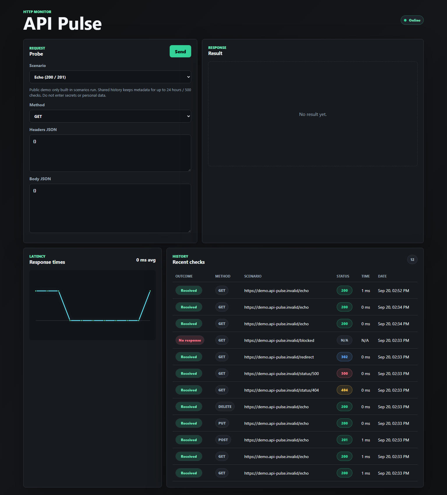

# API Pulse

Probador manual de APIs HTTP con resultados, latencia e historial persistente. Esta versión de portafolio tiene una [demo pública](https://api-pulse-web.onrender.com) gratuita y acotada: permite explorar el flujo completo sin enviar solicitudes a servicios de terceros.

**English summary.** API Pulse is an open-source HTTP API testing dashboard built with Vue 3, FastAPI, and PostgreSQL. Its public demo runs four built-in synthetic scenarios for GET, POST, PUT, and DELETE, then displays the response, latency, and a short shared history. The demo is deployed on Render and Neon free tiers; it does not call arbitrary external APIs.

[Abrir la demo](https://api-pulse-web.onrender.com) · [Ver el código](https://github.com/estebanfrm/Api-Pulse) · [Contrato de la API](docs/API.md) · [Licencia MIT](LICENSE)

## Qué se puede probar

1. Abre la demo y elige **Echo**, **Not found (404)**, **Server error (500)** o **Redirect (302)**. Son escenarios internos: el dominio `.invalid` que aparece en el historial no es un sitio externo.
2. Selecciona GET, POST, PUT o DELETE. Las cabeceras y el cuerpo, si los usas, deben ser objetos JSON; GET no envía cuerpo. Pulsa **Send**.
3. Compara el código, el tiempo, la respuesta y el historial. **Response received** significa que hubo respuesta HTTP, incluso si fue 404 o 500; **No response** indica rechazo o fallo antes de recibir una respuesta. La redirección 302 se muestra sin seguirla.

La demo es anónima y su historial es **compartido**: muestra los 50 registros más recientes y conserva como máximo 500 durante 24 horas. Guarda solo metadatos sintéticos; no guarda cuerpos, cabeceras, IP ni URL arbitrarias. Aun así, **no introduzcas secretos ni datos personales**. La limpieza se aplica al iniciar, crear o listar comprobaciones, no mediante un proceso continuo durante la inactividad.

## Capturas de la demo publicada

Capturas tomadas el 20 de septiembre de 2026 con datos sintéticos. El historial visible cambia a medida que se usa la demo.



[Ver el diseño compacto](docs/screenshots/dashboard-compact.png). La [captura anterior del MVP](docs/screenshots/dashboard.png) se conserva solo como referencia histórica.

## Cómo está construido

| Componente | Tecnología | Función |
| --- | --- | --- |
| Interfaz | Vue 3 + Vite | Formulario, estados de carga/error, resultado, gráfica y tabla |
| API | FastAPI + httpx | Valida solicitudes, aplica límites y ejecuta escenarios sintéticos con `MockTransport` |
| Persistencia | PostgreSQL 16 + SQLAlchemy | Historial compartido y poda de datos |
| Alojamiento de la demo | Render Static Site/Web Service Free + Neon Free | Sitio HTTPS, API HTTPS y base separada; credenciales solo en el backend |

La demo pública **no acepta destinos arbitrarios**: los cuatro escenarios se resuelven dentro del proceso sin DNS ni sockets hacia el destino indicado por un visitante. El modo local de desarrollo sí admite URLs HTTP(S) con controles de seguridad, pero **no está preparado para exponerse a Internet**. Consulta [arquitectura](docs/ARQUITECTURA.md), [decisiones](docs/DECISIONES.md) y [despliegue](docs/DESPLIEGUE_RENDER_NEON.md).

## Ejecutar en local

Requiere Docker Engine y Docker Compose. Desde la raíz del repositorio:

```powershell
if (-not (Test-Path .env)) { Copy-Item .env.example .env }
docker compose up --build -d
docker compose ps
```

Abre la interfaz en `http://localhost:5173`, la API en `http://localhost:8000` y la documentación interactiva en `http://localhost:8000/docs`. Este Compose usa Vite de desarrollo y `PUBLIC_DEMO=false`; no es la configuración pública. No uses credenciales reales en pruebas ni publiques ese stack sin un diseño de seguridad nuevo. Para puertos alternativos, pruebas y cierre del stack, consulta [desarrollo y validación](docs/DESARROLLO_Y_VALIDACION.md).

## Calidad y límites

El [workflow de calidad](https://github.com/estebanfrm/Api-Pulse/actions/workflows/quality.yml) ejecuta pruebas de backend/frontend, Ruff, lint, build, auditoría npm, validación de Compose y un smoke con PostgreSQL 16 efímero. La [validación pública de T07](docs/VALIDACION_T07.md) registra pruebas reales de HTTPS, CORS, cuatro métodos, errores, rechazo de destinos externos, privacidad, cuotas, persistencia, navegador y recuperación tras inactividad.

- Los tiempos de la demo corresponden a respuestas **sintéticas**, no miden la latencia de una API remota. No hay monitorización programada ni alertas.
- Se aplican límites de solicitudes, concurrencia y tamaño. Las cuotas viven en memoria de una única instancia; se comprobó un 429 desde un cliente, pero no la separación por IP entre visitantes distintos detrás del proxy.
- Render y Neon gratuitos pueden entrar en reposo o agotar sus cuotas. No hay garantía de disponibilidad; el uso observado en T07 fue USD 0. La poda de 24 horas/500 registros tiene pruebas automatizadas, pero no se observó todavía durante 24 horas reales en Neon.
- Los cambios futuros del esquema requieren migraciones: `create_all` solo crea tablas faltantes. La ruta de desarrollo que admite URLs externas mantiene una limitación DNS/conexión y no debe desplegarse públicamente.

Las [limitaciones y siguientes mejoras](docs/ESTADO_ACTUAL.md#hallazgos-prioritarios) están registradas sin presentar capacidades no implementadas como existentes.

## Licencia

El código se publica bajo [MIT](LICENSE). Titular indicado por el usuario: **API PULSE**. Las marcas y condiciones de los proveedores de alojamiento son independientes de esta licencia.
